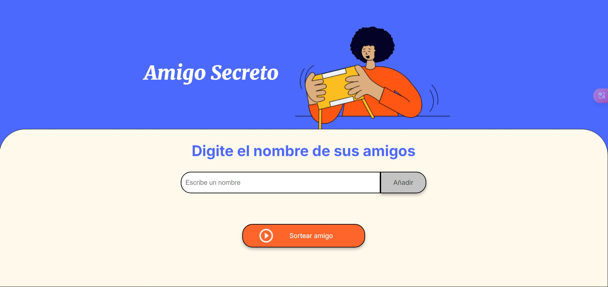
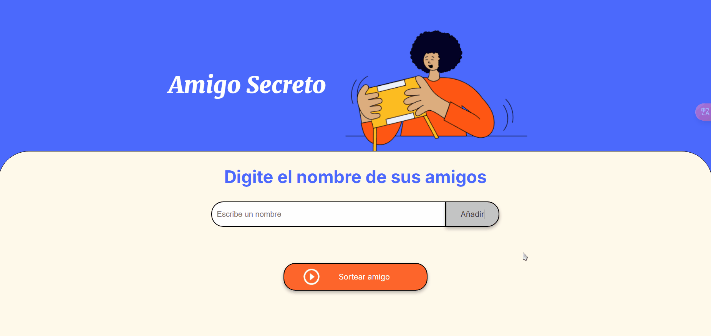
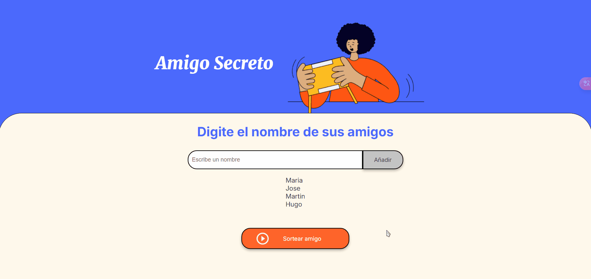

# 🎁 Amigo Secreto | Challenge ONE - Alura Latam

## 📝 Descripción del Proyecto

Este proyecto es parte del Challenge ONE de Alura Latam y Oracle Next Education. Consiste en una aplicación web que permite organizar un sorteo de "Amigo Secreto" de manera sencilla y divertida.

## 🎯 Funcionalidades del proyecto

- Añadir y almacenar nombres de participantes
- Validación de datos ingresados:
  - No permite números ni caracteres especiales
  - Evita nombres duplicados
  - Mínimo 2 caracteres, máximo 30
  - No permite campos vacíos
- Realizar sorteo aleatorio entre participantes
- Interfaz responsiva y amigable

## 💻 Proceso del sorteo

## 🛠️ Tecnologías utilizadas

- HTML5
- CSS3
- JavaScript

## 👥 Desarrollador

- [Jose Andres Meneces Lopez](https://github.com/Jandres25)

#challengeonecodificador 
#AluraLatam 
#OracleNextEducation
